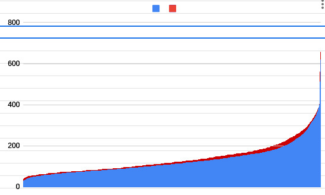

# Equipe A - Tema: American Airlines - Método: Insert Sort

## Histórico de Versão

|    Data    | Versão |           Descrição           |            Autor(es)             |
| :--------: | :----: | :---------------------------: | :------------------------------: |
| 11/01/2023 |  0.1   |     Criação do documento      |           Pedro Helias           |
| 14/01/2023 |  0.2   |     Respondendo últimos problemas e correção em imagens      |           Pedro Helias, Itallo Gravina, Pedro Pagani           |

## Componentes da Equipe:

| Nome            | GitHub      | Matrícula |
| ----------------- | ------------- | -----------  |
|  Itallo Gravina  | [itallogravina](https://github.com/itallogravina) | 160125910 | 
| Matheus Do Vale Lameira | [delvale412](https://github.com/delvale412) | 202070064 |
| Pedro Helias Carlos | [pedrohelias](https://github.com/pedrohelias) | 140158278 |
|  Pedro Paulo Monte Pagani  | [PedroMPagani](https://github.com/PedroMPagani) | 211043736 |

## 1. Código Fonte da Solução

O código fonte da solução se encontra neste <a href="https://github.com/pedrohelias/TP1-AmericanAirlines">repositório</a> nomeado como <b>code.c</b>, utilizamos o mesmo para processar 10% da base de dados. O aquivo nomeado <b>codeTotal.c</b> representa o código que utilizamos para processar 100% da base. Basicamente, os códigos são iguais, alterando apenas as limitações que aplicamos para o código rodar 10% da base. A pasta, em que o código se encontra, é composta pela base de dados utilizada(com alterações apenas em colunas não utilizadas para este projeto), nomeada como <b>bancoAjustado4colunas.csv</b> e o executável do projeto, nomeado como <b>code</b> além da documentação, nomeada como <b>document.md</b> e do arquivo de saída gerado pelo código, nomeado por <b>sorted.csv</b>. 

FOTO RODANDO

## 2. Arquivo de Saída

O arquivo de sáida do projeto se dá pelo processamento e ordenação da base de dados utilizada. Acreditamos que para atingir o solicitado no comando de questão a impressão dos dados ordenados em um outro arquivo seria o ideal. 

Portanto, temos abaixo uma breve amostragem do arquivo de saída

<b>Figura1:</b> Pequeno trecho do arquivo de saída
 

 
<b>Fonte:</b> Autoria própria

<b>Figura2:</b> Gráfico
 

 
<b>Fonte:</b> Autoria própria

## 3. Complexidade do Algorítimo de Ordenação Escolhida

### 3.1. Complexidade
- Complexidade Quadrática O(N²)

### 3.2. Tempo de Processamento

<b>Figura3:</b> Tempo de processamento do algoritmo com 10%
 

 
<b>Fonte:</b> Autoria própria

CPU Usada no benchmark\
\
i7-1139OH - Stock 3.40Ghz, turbo 5Ghz
\
Tempo de execucao apenas dando sort em 53.9k linhas

<b>Figura4:</b> Tempo de processamento do algoritmo completo
 

 
<b>Fonte:</b> Autoria própria

CPU Usada no benchmark\
\
i7-1139OH - Stock 3.40Ghz, turbo 5Ghz
\
Tempo de execucao apenas dando sort em 53.9k linhas

